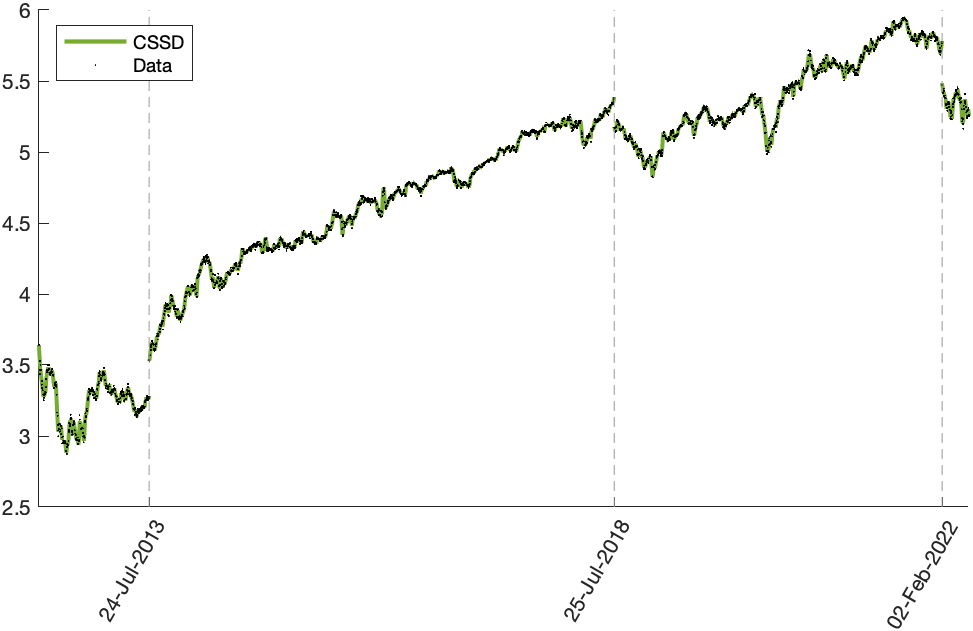

# CSSD - Cubic smoothing splines for discontinuous signals

This is a reference implementation in Matlab for the algorithms described in the paper

**M. Storath, A. Weinmann, "Smoothing splines for discontinuous signals", 2022**

## Overview of main functionalities
1. **cssd.m** computes a cubic smoothing spline with discontinuities (CSSD) for data (x,y). It is a solution of the following model of a smoothing spline $f$ with a-priori unknown discontinuities $J$

  $$\min_{f, J} p \sum_{i=1}^N \left(\frac{y_i - f(x_i)}{\delta_i}\right)^2   +  (1-p) \int_{[x_1, x_N] \setminus J}   (f''(t))^2 dt	 + \gamma |J|.$$

  where
  *  $y_i = g(x_i) + \epsilon_i$ are samples of piecewise smooth function $g$ at data sites $x_1, \ldots, x_N$, and an estimate $\delta_i$  of the standard deviation of the errors $\epsilon_i$
  * the minimum is taken over all possible sets of discontinuities between two data sites $J \subset [x_1, x_N]\setminus \{x_1, \ldots, x_N\}$
   and all functions $f$ that are twice continuously differentiable away from the discontinuities.
  * The model parameter $p \in (0, 1)$ controls the relative weight of the smoothness term (second term) and the data fidelity term.
  * The last term is a penalty for the number of discontinuities $|J|$ weighted by a parameter $\gamma > 0.$ 

2. **cssd_cv.m** automatically determines values for the model parameters $p$ and $\gamma$ based on K-fold cross validation.

## Quickstart
1. Execute "install_cssd.m" which adds the folder and all subfolders to the Matlab path.
2. Execute any m-file from the demos folder

## Examples

### Synthetic data
<figure>
  
  <figcaption>A synthetic signal is sampled at $N = 100$ random data sites $x_i$ 
	and corrupted by zero mean Gaussian noise with standard deviation 
$0.1.$
	The results of the discussed model are shown for $p=0.999$ and different parameters of $\gamma,$ where $\gamma=\infty$  corresponds to classical smoothing splines.
	The thick lines 
represent the results of the shown sample realization.	 The shaded areas depict the $2.5 \%$ to $97.5 \%$  (pointwise) quantiles of $1000$ realizations. The histograms under the plots show the frequency of the detected discontinuity locations over all realizations.
</figcaption>
</figure>

### Stock data
<figure>
  
  <figcaption>The dots represent the logarithm of the closing prices of the Meta stock from May 18, 2012, 
	to May 19, 2022. The curve represents the CSSD with parameters determined by K-fold CV ($p = 0.4702$,  $\gamma = 0.0069$). The dashed vertical lines indicate the discontinuities of the CSSD, and the ticks correspond to the date before the discontinuity.
</figcaption>
</figure>

### Geyser data
<figure>
  
  <figcaption>Fitting a CSSD to the Old Faithful data (circles):
	If the parameter is selected based on K-fold CV
	we obtain a result without discontinuities which coincides with a classical smoothing spline (solid curve).
	Keeping the selected $p$-parameter and lowering the $\gamma$ parameter sufficiently gives a two-phase regression curve (dashed curves) with a breakpoint near $x = 3$ (dashed vertical line), and the two curve segments are nearly linear. 
	Both of the above parameter sets yield better CV-scores  than a linear model (dotted line).
</figcaption>
</figure>

## Reference

M. Storath, A. Weinmann, "Smoothing splines for discontinuous signals", 2022
